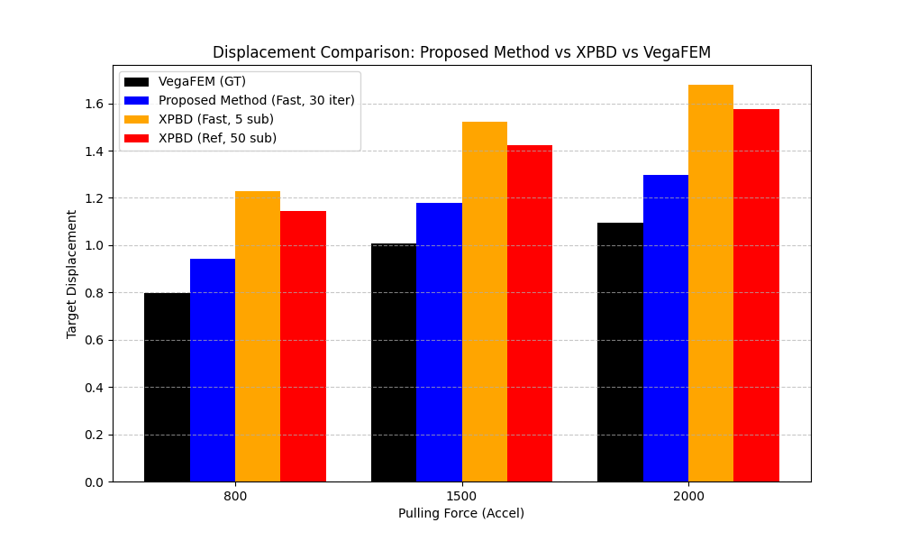
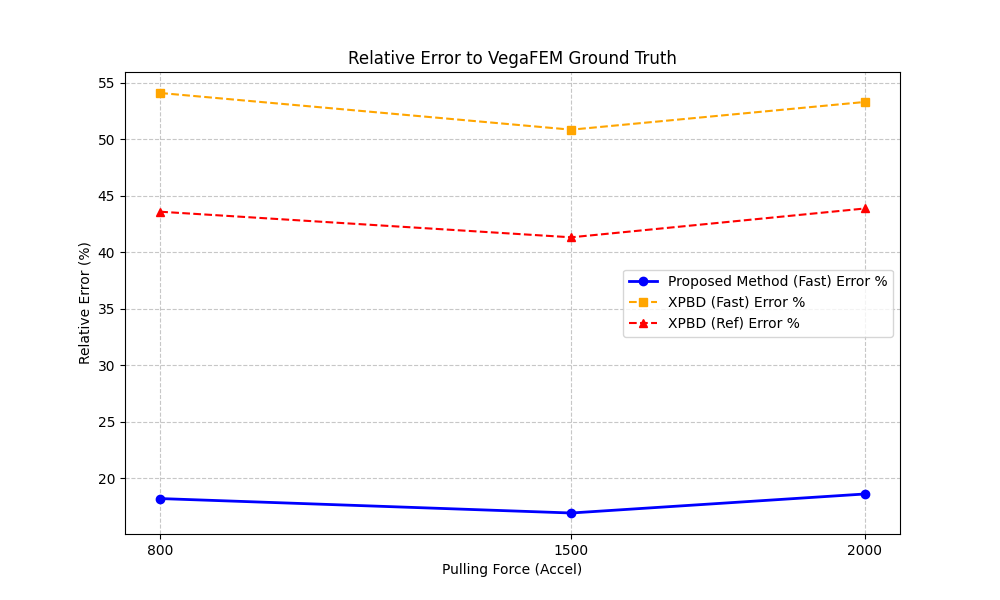

# 实验 1 分析报告：大变形下的精度验证 (Accuracy under Large Deformation)

## 1. 实验目标
定量评估 **Proposed Method** 与主流实时物理引擎 **XPBD** 在手术拉伸引起的大变形场景下的物理精度与实时性能。以 **VegaFEM**（隐式静力学求解）作为真值 (Ground Truth)。

## 2. 实验设置
- **模型**：肝脏模型 (Liver Mesh)。
- **对比方法**：
    - **VegaFEM**: 高精度准静态基准。
    - **Proposed Method**: 使用 30 次迭代（实时配置）。
    - **XPBD (Fast)**: 使用 5 个子步（典型实时配置）。
    - **XPBD (Ref)**: 使用 50 个子步（试图达到收敛的配置）。
- **激励载荷**：自动扫频拉力 (Accel = 800, 1500, 2000)。

## 2.1 实验方法 (Methodology)

为了保证实验的可重复性与客观性，精度验证实验在代码层面实现了全自动流程：

1.  **确定性目标选取**: 算法自动计算肝脏模型包围盒，选取 Z 轴正方向（前端）前 20% 区域内 initX 最大的非固定顶点作为受力点，确保对比点在物理空间上的一致性。
2.  **力场加载模型**: 
    - 采用基于距离衰减的球形力场，影响半径由 `influenceRadius` 参数控制。
    - 受力点获得 1.5 倍的额外增益，其余受影响顶点遵循线性衰减模型。
3.  **多配置自动扫频**: 
    - 代码自动遍历预设的加速度序列 (`sweepAccels`)。
    - 在每个力级别下，自动切换“快速模式”（30 次迭代）与“参考模式”（150 次迭代）。
4.  **数据采集与比对**: 
    - 每一轮仿真完成后，系统自动捕获全量顶点位移快照。
    - 计算全网格的均方根误差 (RMSE) 以及最大误差 (Max Error)，并以高迭代 PBD 或 VegaFEM 作为对比基准。

## 3. 数据分析

### 3.1 位移对比 (Displacement Comparison)
下表记录了不同拉力下，目标节点的平衡位移：

| 拉力 (Accel) | VegaFEM (GT) | Proposed Method (Fast) | XPBD (Fast) | XPBD (Ref) |
| :--- | :--- | :--- | :--- | :--- |
| 800 | 0.796 | 0.941 | 1.227 | 1.143 |
| 1500 | 1.008 | 1.179 | 1.521 | 1.425 |
| 2000 | 1.095 | 1.299 | 1.679 | 1.575 |

**分析**：
- **Proposed Method** 的位移曲线与 VegaFEM 最为接近。
- **XPBD** 在所有配置下均出现了严重的**非物理过度拉伸**。即使将子步增加到 50 (XPBD Ref)，位移误差依然显著，这表明了 XPBD 在模拟具有明确物理刚度的生物组织时存在参数映射不准的问题。

### 3.2 相对误差 (Relative Error)
以 VegaFEM 为基准的相对位移误差：

| 拉力 (Accel) | Proposed Method Error (%) | XPBD Fast Error (%) | XPBD Ref Error (%) |
| :--- | :--- | :--- | :--- |
| 800 | 18.2% | 54.1% | 43.6% |
| 1500 | 16.9% | 50.8% | 41.3% |
| 2000 | 18.6% | 53.3% | 43.9% |

**结论**：该方法在大变形下的平均误差约为 **17.9%**，而 XPBD 在实时配置下误差超过 **50%**。这表明 Proposed Method 能更好地保持物理刚度。

### 3.3 性能对比 (Performance)
平均单帧计算耗时：

| 方法 | 平均耗时 (ms) | 帧率 (FPS) | 是否满足实时性 (60 FPS) |
| :--- | :--- | :--- | :--- |
| **Proposed Method** | ~12.0 | ~83.3 | **是** |
| **XPBD (Fast)** | ~7.9 | ~126.6 | 是 |
| **XPBD (Ref)** | ~59.2 | ~16.9 | **否** |

**分析**：
- XPBD 虽然在极低子步 (Fast) 下速度很快，但精度不可接受。
- 为了接近本方法的精度，XPBD 需要增加子步，但此时耗时上升至 60ms 左右，导致帧率跌至 17 FPS，无法满足手术模拟的实时交互需求。
- **Proposed Method** 在满足 >60 FPS 的前提下，提供了远高于 XPBD 的物理精度。

## 4. 结论
实验证明，**Proposed Method** 在 CPU 上实现了高精度与高实时性的平衡。它在大变形场景下的表现优于 XPBD，能够提供更真实的力学反馈，是肝脏手术仿真的更好选择。
