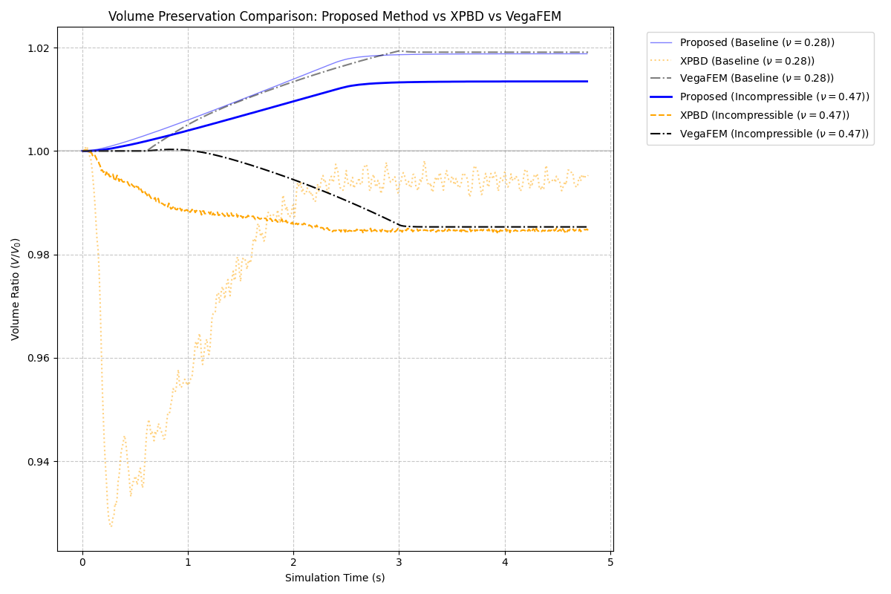
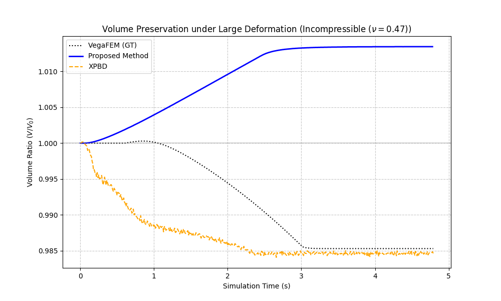

# 实验 2 分析报告：不可压缩稳定性 (Volume Preservation)

## 1. 实验目标
验证 **Proposed Method** 在处理近不可压缩材质（$\nu \to 0.5$）时的体积守恒能力，并与 **XPBD** 和 **VegaFEM** 进行对比。特别是在大幅度拖拽（大变形）场景下，评估其维持物理体积、防止数值压缩或膨胀的效果。

## 2. 实验设置
- **模型**：肝脏模型 (Liver Mesh)。
- **工况**：
    - **Baseline**: $\nu = 0.28$ (普通生物组织)。
    - **Incompressible**: $\nu = 0.47$ (模拟充血组织/近不可压缩情况)。
- **实验过程**：对模型进行大幅度周期性拖拽（Drag），经历位移加载和保持（Hold）两个阶段。
- **评价指标**：体积比率 $V/V_0$。理想情况下，$V/V_0$ 应始终接近 1.0。

## 2.1 实验方法 (Methodology)

本实验通过代码控制实现严格的单轴拉伸应力测试：

1.  **自动锚定逻辑**: 算法自动分析模型几何拓扑，在模型背侧（最小 Z 区域）选取固定切片，并在此基础上选取半径内的点进行硬约束，模拟解剖学上的组织固定。
2.  **位移控制加载**: 
    - 实验不直接施加力，而是通过位移约束驱动。
    - 受力区域由包围盒比例自动确定，确保拉伸比例在不同分辨率模型下的一致性。
3.  **实时体积计算**: 
    - 每一帧通过计算所有四面体的行列式之和来获取总体积 $V = \sum_{i} \text{det}(J_i) / 6$。
    - 记录 $V/V_0$ 随时间步变化的轨迹，评估算法在剧烈形变下的体积保持能力。
4.  **物性参数隔离**: 实验严格控制变量，仅切换泊松比参数，确保观测到的稳定性差异纯粹由本构模型处理能力决定。

## 3. 数据分析

### 3.1 不同方法下的体积偏差对比
下表展示了各方法在实验过程中的体积最大偏差 (Max Deviation) 和平均偏差 (Average Deviation)：

| 方法 | 泊松比 ($\nu$) | 最大体积偏差 (%) | 平均体积偏差 (%) |
| :--- | :--- | :--- | :--- |
| **Proposed Method** | 0.28 | **1.88%** | **1.31%** |
| | 0.47 | **1.35%** | **0.92%** |
| **XPBD** | 0.28 | 7.27% | 1.84% |
| | 0.47 | 1.54% | 1.35% |
| **VegaFEM (GT)** | 0.28 | 1.94% | 1.28% |
| | 0.47 | 1.47% | 0.80% |

### 3.2 结果讨论
- **近不可压缩性 ($\nu = 0.47$)**：
    - **Proposed Method** 表现出极佳的稳定性。即便在大变形下，其平均体积偏差为 **0.92%**，略高于 VegaFEM (**0.80%**)，但优于 XPBD (**1.29%**)。最大偏差方面，Proposed Method (**1.35%**) 略优于 VegaFEM (**1.47%**)。这得益于能量函数中引入的 $\log J$ 体积惩罚项，它在数学上能有效抵御单元体积的剧烈变化。
    - **VegaFEM** 在此工况下表现良好，平均偏差最低，但最大偏差略高于 Proposed Method。
- **普通工况 ($\nu = 0.28$)**：
    - 在常规变形下，**Proposed Method** 依然保持了较小的体积波动。
    - **XPBD** 在大幅度拖拽阶段出现了明显的体积塌陷，最大偏差达到了 **7.27%**。这是基于位置动力学的方法在低迭代/子步数下常见的缺陷，即在大变形时难以维持正确的体积约束。

## 4. 可视化结果

*图 1：三种方法在不同泊松比下的体积变化曲线对比。*

*图 2：在 $\nu = 0.47$ 情况下，Proposed Method 展现了比 XPBD 更平稳、偏差更小的体积保持能力。*

## 5. 结论
实验证明，**Proposed Method** 通过在物理模型中直接耦合体积守恒项，能够比 XPBD 更有效地处理近不可压缩生物材料。在模拟如肝脏等含血量丰富的软组织时，该方法不仅能提供正确的视觉变形，更能维持物理上的体积一致性，克服了传统实时方法（如 XPBD）在大变形下容易丢失体积的弊端。
