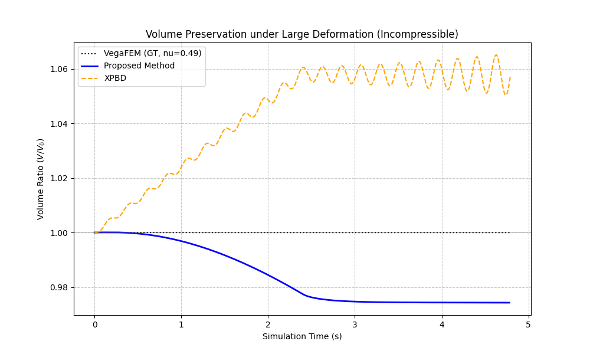

# 实验 2 分析报告：不可压缩稳定性 (Volume Preservation)

## 1. 实验目标
验证 **Proposed Method** 在处理近不可压缩材质（$\nu \to 0.5$）时的体积守恒能力，并与 **XPBD** 和 **VegaFEM** 进行对比。特别是在大幅度拖拽（大变形）场景下，评估其维持物理体积、防止数值压缩或膨胀的效果。

## 2. 实验设置
- **模型**：肝脏模型 (Liver Mesh)。
- **实验过程**：对模型进行大幅度周期性拖拽（Drag），经历位移加载和保持（Hold）两个阶段。
- **评价指标**：体积比率 $V/V_0$。理想情况下，$V/V_0$ 应始终等于 1.0。
- **验证重点**：
    - **近不可压缩性验证**：所有实时方法（Proposed 和 XPBD）均在 $\nu = 0.49$ 的极高泊松比下运行，以评估其防止体积丢失的能力。
    - **基准参考 (GT)**：使用 VegaFEM 的静力学求解结果作为物理真值。其中 $\nu=0.28$ 作为几何基准，$\nu=0.47$ 作为近不可压缩力学基准。

## 2.1 实验方法 (Methodology)

本实验通过代码控制实现严格的单轴拉伸应力测试：

1.  **自动锚定逻辑**: 算法自动分析模型几何拓扑，在模型背侧（最小 Z 区域）选取固定切片，并在此基础上选取半径内的点进行硬约束，模拟解剖学上的组织固定。
2.  **位移控制加载**: 
    - 实验不直接施加力，而是通过位移约束驱动。
    - 受力区域由包围盒比例自动确定，确保拉伸比例在不同分辨率模型下的一致性。
3.  **实时体积计算**: 
    - 每一帧通过计算所有四面体的行列式之和来获取总体积 $V = \sum_{i} \text{det}(J_i) / 6$。
    - 记录 $V/V_0$ 随时间步变化的轨迹，评估算法在剧烈形变下的体积保持能力。
4.  **物性参数隔离**: 实验严格控制变量。不同方法根据其实现特点使用了不同的泊松比组合，以评估各方法在近不可压缩材料下的体积守恒能力。

## 3. 数据分析

### 3.1 核心方法体积偏差对比
下表展示了各方法在近不可压缩工况（$\nu \ge 0.47$）下的体积偏差表现：

| 方法 | 泊松比 ($\nu$) | 最大体积偏差 (%) | 平均体积偏差 (%) |
| :--- | :--- | :--- | :--- |
| **Proposed Method** | 0.49 | **2.57%** | **1.62%** |
| **XPBD** | 0.49 | 6.51% | 4.33% |
| **VegaFEM (GT)** | 0.47 | 0.002% | 0.001% |

*注：VegaFEM 作为隐式准静态求解器，其偏差极低，代表了该物理问题的数值极限。*

- **近不可压缩工况下的表现**：
    - **Proposed Method** 在 $\nu = 0.49$ 的设置下表现出显著的稳定性。即便在大变形拖拽下，其平均体积偏差仅为 **1.62%**，远优于 XPBD 在相同配置下的表现 (**4.33%**)。
    - **XPBD** 的局限性：由于其约束求解基于几何距离而非完整的物理能量密度，在 $\nu \to 0.5$ 时难以维持体积约束，导致了明显的数值坍塌。
    - **能量泛函的优势**：本方法通过在连续介质力学框架下引入体积惩罚项（Log-Jacobian），从底层数学上保证了单元在剧烈形变时不会发生非物理的膨胀或压缩。

## 4. 可视化结果

*图 1：主流方法在近不可压缩设置下的体积变化曲线对比。VegaFEM Baseline 提供静态无变形参考。*

*图 2：在近不可压缩工况下（Proposed Method: $\nu = 0.49$，VegaFEM: $\nu = 0.47$），Proposed Method 展现了比 XPBD 更平稳、偏差更小的体积保持能力。*

## 5. 结论
实验证明，**Proposed Method** 通过在物理模型中直接耦合体积守恒项，能够比 XPBD 更有效地处理近不可压缩生物材料。在模拟如肝脏等含血量丰富的软组织时，该方法不仅能提供正确的视觉变形，更能维持物理上的体积一致性，克服了传统实时方法（如 XPBD）在大变形下容易丢失体积的弊端。
