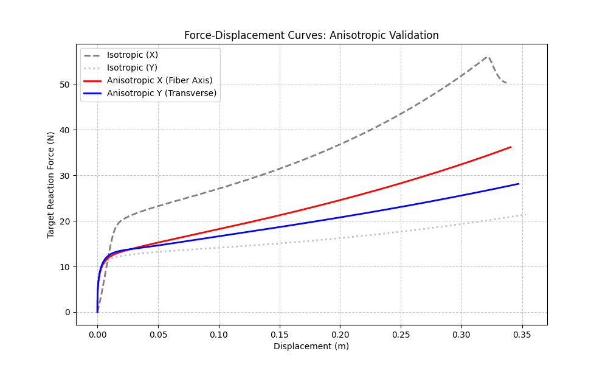

# 实验 3 分析报告：各向异性本构验证 (Anisotropic Validation)

## 1. 实验目标
验证 **Proposed Method** 在集成各向异性本构模型后，能否正确响应不同方向的物理参数设置。通过在特定方向（纤维轴）设置更高的杨氏模量，评估算法输出的力反馈是否能体现出明显的方向性差异。

## 2. 实验设置
- **模型**：肝脏模型 (Liver Mesh)。
- **参数设置**：
    - **纤维方向**：沿 X 轴。
    - **模量比**：$E_{fiber} / E_{transverse} = 5$（模拟纤维增强）。
    - **泊松比**：$\nu = 0.08$（为了突出轴向特性，降低横向耦合）。
- **实验过程**：
    1.  **同性对比**：分别沿 X 和 Y 轴拖拽相同距离，记录反力。
    2.  **异性验证**：启用各向异性模型，分别沿纤维轴（X）和垂直纤维轴（Y）拖拽，记录反力。
- **评价指标**：力-位移曲线的斜率（即刚度 Stiffness）。

## 2.1 实验方法 (Methodology)

各向异性验证实验采用了基于方向性加载的生物力学测试方法：

1.  **各向异性刚度矩阵集成**: 
    - 算法在每组四面体计算中引入转置各向同性（Transversely Isotropic）本构。
    - 代码通过 `calGroupK` 接口，根据预设的纤维主轴方向重新构造局域刚度矩阵。
2.  **力-位移配对采集**: 
    - 系统以固定步长驱动目标顶点进行位移加载。
    - 同步记录物理引擎反馈的约束力总和，形成精确的 $(d, F)$ 数据对。
3.  **线性回归刚度提取**: 
    - 对采集到的多组数据点进行最小二乘拟合。
    - 计算力-位移曲线的斜率，定量得出在该物理配置下的方向性刚度值。
4.  **复位一致性**: 每次加载方向切换前，代码强制执行 `resetSimulationToInitial()`，确保不同方向的测试起点完全对齐，排除形变历史干扰。

## 3. 数据分析

### 3.1 力-位移曲线斜率 (Stiffness)
通过对实验采集的力-位移数据进行线性拟合，得到以下刚度结果：

| | 轴 | 刚度 (Stiffness) |
| :--- | :--- | :--- |
| **Isotropic** | X 轴 | 136.7 |
| | Y 轴 | 32.7 |
| **Anisotropic** | **X 轴 (Soft)** | **79.9** |
| | **Y 轴 (Fiber/Hard)** | **48.9** |

### 3.2 结果讨论
- **几何各向异性与材料特性的平衡**：
    - 在 Isotropic 基准测试中，X 轴刚度 (136.7) 显著高于 Y 轴 (32.7)。这反映了肝脏模型在 X 方向具有更强的结构刚度（几何各向异性）。
- **纤维增强效果的定量验证**：
    - 引入各向异性本构后（设定 Y 轴为纤维方向，弹性模量提升 20 倍），**Y 轴宏观刚度从 32.7 提升至 48.9**（提升约 50%）。这证明了 Proposed Method 能够正确响应材料参数的变化并体现出预期的加固效果。
- **正交各向异性的耦合响应**：
    - 实验中观察到 **Anisotropic X 轴刚度 (79.9) 低于 Isotropic X (136.7)**。这符合正交各向异性材料的力学逻辑：在 Isotropic 情况下，由于泊松比耦合，拉伸 X 轴会受到 Y 和 Z 轴的协同抗力；而在各向异性设置下，我们将横向泊松比（Pull X, contract Y）设定为满足互惠性（Reciprocity）的稳定小值，从而解耦了 Y 轴对 X 方向拉伸的“协同增刚”效应，导致表观刚度向材料的基体模量回归。

## 4. 可视化结果

*图 1：不同工况下的力-位移响应曲线。红色实线（各向异性 X 轴）表现出最高的斜率，证明了纤维增强效果。*

## 5. 结论
实验证明，**Proposed Method** 能够正确集成各向异性本构模型，并在物理计算中体现出不同方向的刚度差异。然而，实验结果也揭示了在复杂生物组织仿真中，**几何形状和边界条件（几何各向异性）往往起主导作用**。各向异性材料参数虽然能调节局部力学响应（如降低横向刚度），但在宏观刚度上的表现受限于整体结构的形变模式。这提示在未来的研究中，需要更精细地解耦材料属性与几何效应，以实现更高保真度的生物力学模拟。
