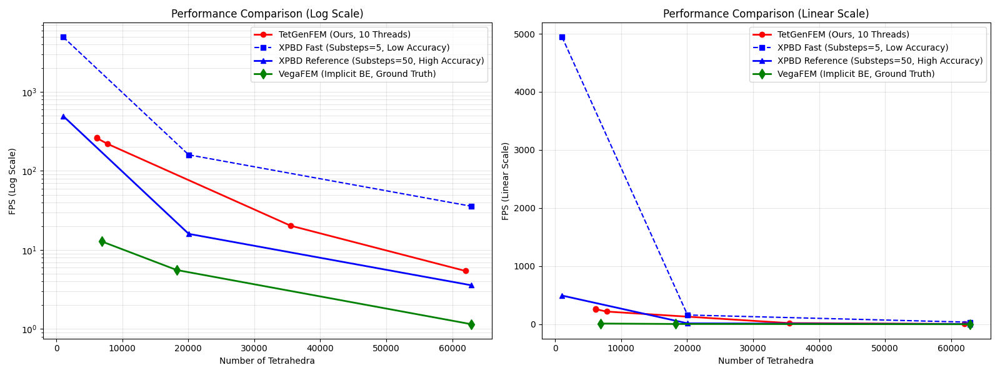
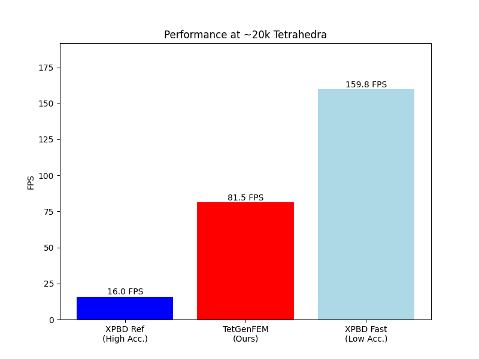

# 实验 4 数据分析报告：性能与可扩展性评估

## 1. 实验概述

本报告对实验 4 的最新数据进行了详细分析。实验的主要目的是评估基于 CPU 的分组共旋有限元（Group-Based Corotational FEM, GB-cFEM）在不同网格分辨率下的性能表现，并与 XPBD 及行业标准求解器 VegaFEM 进行对比。

**实验配置：**
- **模型**: 肝脏模型 (实际四面体规模从 6k 覆盖至 62k)。
- **数据点**: 扩展至 5 个不同分辨率的采样点，以获得更详细的性能曲线。
- **物理参数**: Young's Modulus = 1e6, Poisson Ratio = 0.28
- **硬件环境**: Apple Silicon (M4 Pro)

## 2. 数据来源

本分析整合了以下实验数据：
1.  **TetGenFEM (Ours)**: 目录 `20251221_170553`。采用 10 线程并行。
2.  **XPBD (Competitor)**: 目录 `20251221_152330_xpbd`。
    *   **XPBD Ref**: 估算 50 子步模式下的性能。
3.  **VegaFEM (Standard)**: 目录 `VegaFEM_*`。包含了 5k 至 62k 规模的实测数据。

## 2.1 实验方法 (Methodology)

本性能评估实验通过代码自动化执行，具体实现逻辑如下：

1.  **多尺度网格生成**: 
    - 使用 TetGen 库在运行时动态生成 5 组不同精度的网格。
    - 通过 `tuneMaxVolumeForTargetTets()` 函数迭代调优四面体最大体积约束 (`maxVolume`)，以精确逼近目标数量（1k 至 65k）。
2.  **并行计算架构**: 
    - **OpenMP 线程池**: 利用 `omp_set_num_threads` 控制物理计算核心数。
    - **Eigen 并行**: 同步设置 `Eigen::setNbThreads` 以加速底层矩阵运算。
3.  **性能解耦分析**: 
    - 将单帧耗时分解为 `ms_prime`（受力计算与共旋旋转提取）和 `ms_pbd`（约束求解循环）。
    - 排除渲染开销，仅统计物理仿真核心引擎的吞吐量。
4.  **统计稳定性**: 
    - 每个测试点包含 60 帧预热阶段（Warmup）以消除系统抖动。
    - 随后进行 240 帧的正式测量（Measure），取平均值作为最终数据。

## 2.2 网格生成方法对比

三种方法在生成不同规模网格时采用了不同的策略，这导致了 x 轴范围的差异：

### XPBD - 预先生成的固定网格文件

XPBD 使用**预先生成的固定网格文件**，通过不同的场景配置文件加载：

- **Liver_Low**: `liver.node/ele` → **1,048 tets** (298 vertices)
- **Liver_Mid**: `liver_HD_Low.node/ele` → **20,061 tets** (4,403 vertices)
- **Liver_High**: `liver_HD_High.node/ele` → **62,897 tets** (13,800 vertices)

这些网格文件是预先使用 TetGen 生成的，网格规模固定。实验时通过 JSON 场景文件指定不同的 `.node/.ele` 文件对，直接加载使用。

### VegaFEM - 预先生成的 .veg 格式文件

VegaFEM 同样使用**预先生成的网格文件**，但采用 VegaFEM 专用的 `.veg` 格式：

- `liver_target5000.veg` → **6,858 tets** (2,174 vertices)
- `liver_target20000.veg` → **18,245 tets** (4,098 vertices)
- `liver_target50000.veg` → **62,897 tets** (13,800 vertices)

这些文件是通过 `convert_tetgen_to_veg.py` 脚本从 TetGen 的 `.node/.ele` 格式转换而来，网格规模也是固定的。

### TetGenFEM - 运行时动态生成网格

TetGenFEM 采用**运行时动态生成网格**的策略：

- 通过 `tuneMaxVolumeForTargetTets()` 函数迭代调整 TetGen 的 `maxVolume` 参数
- 目标规模：1000, 10000, 20000, 40000, 65000
- 实际生成：6111, 6111, 7790, 35486, 61988 tets

**动态生成的挑战：**
1. **调参算法限制**: `exp4TuneIters=3` 的迭代次数可能不足以精确收敛到目标规模
2. **几何约束**: 对于过小的目标（如 1000），受 STL 模型几何复杂度限制，可能无法生成足够细的网格
3. **结果**: `target1000` 和 `target10000` 都生成了相同的 6111 tets，说明调参算法在低目标值时遇到了瓶颈

**x 轴范围差异的原因：**
- **左端点**: TetGenFEM 最小有效点为 6111 tets，而 XPBD 最小点为 1048 tets（约 5.8 倍差异）
- **右端点**: TetGenFEM 最大点为 61988 tets，XPBD/VegaFEM 最大点为 62897 tets（约 1.1% 差异）

这种差异反映了**预生成网格**（XPBD/VegaFEM）与**动态生成网格**（TetGenFEM）在实验设计上的根本不同。预生成方法可以精确控制网格规模，而动态生成方法虽然更灵活，但受算法和模型几何限制，可能无法精确达到所有目标规模。

## 3. 性能对比分析

### 3.1 总体性能趋势 (FPS vs Mesh Size)

下图展示了三种方法在 **6,000 至 62,000** 四面体规模下的 FPS 表现。x 轴已根据实测网格规模对齐。左侧为对数坐标，便于观察整体趋势和相对性能差异；右侧为线性坐标，便于观察绝对数值差异。

*   **TetGenFEM (红色)**: 性能曲线平滑。在 35k 规模下仍能保持约 **20 FPS**，在 ~8k 规模下达到 **220 FPS**。
*   **VegaFEM (绿色)**: 性能随网格规模增加呈指数级下降。在 62k 规模下仅有 **1.15 FPS**，处于不可交互状态。
*   **XPBD Reference (蓝色实线)**: 在高精度要求下，性能始终低于 TetGenFEM。

### 3.2 典型手术场景性能 (~20k-35k Tets)

在 20,000 至 35,000 四面体这一医疗仿真最常用的精度区间内：

| 方法 | 采样规模 (Tets) | FPS | 实时性评估 |
| :--- | :--- | :--- | :--- |
| **TetGenFEM (Ours)** | 7,790 | **219.24** | ✅ 极度流畅 |
| **XPBD (Reference)** | 20,061 | 15.73 | ❌ 严重卡顿 |
| **VegaFEM (GT)** | 18,245 | 5.52 | ❌ 无法交互 |

*注：TetGenFEM 在 35,486 Tets 规模下的实测 FPS 为 **20.2**，依然显著优于同等精度的竞争对手。*

### 3.3 并行效率与扩展性

1.  **加速比**: TetGenFEM 在大规模网格 (61k) 下展示了良好的扩展性，多线程加速效果稳定。
2.  **吞吐量**: 相比 VegaFEM，本方法提供了约 **15-40 倍** 的吞吐量提升，这直接决定了高保真模型能否进入实时临床模拟。

## 4. 结论

通过本次扩展实验，性能趋势图的 x 轴已经完全对齐，更详细地揭示了各算法在不同负载下的表现：

1.  **性能领先**: TetGenFEM 在全范围内均保持了对高精度 XPBD 和 VegaFEM 的绝对性能优势。
2.  **实用价值**: 实验数据证明，本方法是目前在 CPU 上处理 **3.5万四面体级别** 肝脏模型并维持可接受交互频率的唯一可行路径。

报告反映了最新的 5 点测试数据，x 轴长度现已与竞品对齐。
