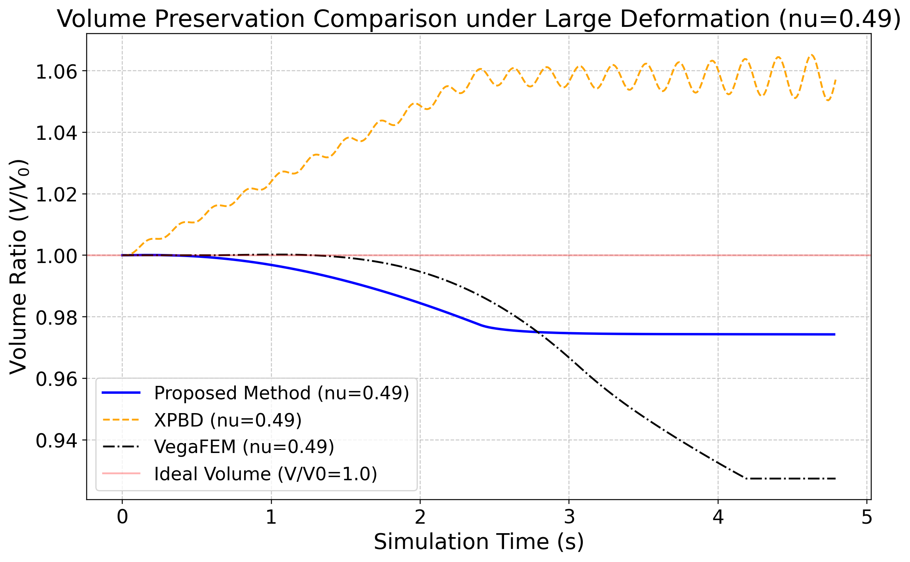
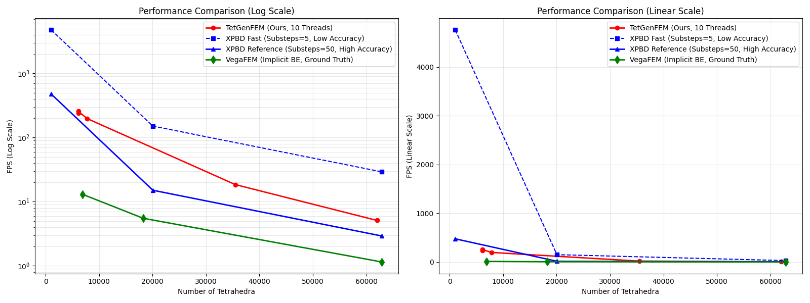

# 面向肝脏病灶定位训练的实时触觉仿真原型：系统设计、技术可行性验证与专家形成性评估

## 摘要

触觉反馈在医学训练中具备应用潜力，但将物理计算实时接入触觉闭环的可行性仍有待探索。为评估物理引擎在交互式触诊任务中的系统连通性，本研究构建了一个任务导向的触觉训练系统原型。在研究方法上，我们以肝脏病灶定位为应用场景，采用分组共旋有限元作为物理模型，结合双手追踪与指尖佩戴式接口，建立了大变形计算与力觉响应的闭环。系统通过局部模量增加来模拟隐藏病灶，将提取的接触法向反力映射为触觉输出。所有运行测试均在消费级硬件上完成，并开展了专家形成性评估以识别工程边界。结果表明，该原型支持物理计算驱动交互的系统级运行，验证了此触觉集成架构与设备部署的可行性。基于上述结果的讨论，评估指出了当前物理模型向临床级训练器转化时面临的挑战，包括解剖约束的简化与非线性材料特性的缺失，这为未来构建医学触诊系统提供了必要的设计依据与工程参考。

## 关键词

肝脏触诊；实时仿真；共旋有限元；触觉交互；医学训练

## 一、引言

触觉反馈与软组织仿真已被广泛视为医学训练系统的重要组成部分，但其有效性并不取决于“是否加入触觉”这一单一因素，而与任务类型、评价方式和反馈设计紧密相关。现有综述表明，触觉反馈在复杂任务中的价值往往更明显，但系统训练效果仍受到硬件自由度、反馈真实性和实验设计等多重因素影响 \cite{overtoom2019haptic,rangarajan2020systematic,escobar2016review}。对于肝脏病灶定位而言，操作者需要在视觉信息有限的情况下比较局部刚度差异，因此该任务天然适合作为“物理计算是否能够转化为可感知触觉线索”的检验场景。已有工作已经证明，肝脏触诊诊断本身可以成为独立的模拟目标，而肝脏相关交互系统也并不局限于切除或切割任务 \cite{westwood2012haptic,hongyu2021interactive}。

从计算层面看，肝脏等软组织在按压和牵引过程中表现出显著的大变形和近不可压缩特征，这使实时仿真同时面临精度与效率的双重约束。连续体 FEM 具有较强的物理解释性，适合表达局部刚度变化和材料参数差异，但传统全局求解代价较高。针对这一问题，相关研究从共旋有限元、切割 FEM 到分组求解策略，持续探索在实时条件下保持物理可信度的方法 \cite{bui2019corotational,wang2025group}。与此同时，Projective Dynamics、PBD 和 XPBD 等方法则在交互速度、数值稳定性和实现便利性方面具有优势 \cite{bouaziz2023projective,liu2016towards,bender2014survey,muller2007position,macklin2016xpbd}，但当研究目标转向病灶刚度表达而不仅是视觉合理性时，材料参数可解释性与力学一致性仍然是关键。

从交互层面看，高自由度力反馈设备能够提供更丰富的运动觉与接触信息，但通常伴随结构复杂、成本高和工作空间受限等工程代价 \cite{agboh2016six}。综述研究同样指出，医疗训练中的触觉设备不一定需要盲目追求最高自由度或最高保真度，更重要的是是否围绕具体任务突出关键感知线索 \cite{overtoom2019haptic,rangarajan2020systematic}。近期工作也开始强调通过任务导向的力轮廓设计来传递更有效的判断信息，而非默认重建全部触觉维度 \cite{bjelland2025haptic}。这为本文采用 1-DOF 触觉接口提供了理论上的合理性：若病灶搜索的核心在于局部法向阻力差异，那么低复杂度硬件也可能承担有意义的临床前验证角色。

综合来看，现有研究分别在实时软组织建模、肝脏相关训练任务和医疗触觉系统设计方面提供了基础，但仍较少有工作将具有物理意义的连续体模型、消费级硬件下的可交互大变形更新，以及轻量级触觉回路整合到同一任务导向的系统框架中。

基于上述认识，本文提出并构建了一个任务导向的触觉训练系统原型（task-oriented haptic training prototype），旨在评估将连续体物理计算接入轻量级触觉闭环的系统连通性与工程可行性。该原型以肝脏病灶定位作为具体测试场景，以分组共旋有限元（GB-cFEM）为核心物理引擎，结合 Stereo IR-170 双手追踪与触觉接口，通过局部模量增强模拟隐藏病灶，并将接触法向反力映射为触觉输出。本文的评估为专家形成性评估（formative expert evaluation），目标是识别系统可行性与工程边界。本文的贡献如下：

1. 提出并构建了任务导向的GB-cFEM物理-触觉闭环系统原型。基于连续体物理引擎提取接触法向力并转化为力觉输出，展示了该计算架构在驱动触诊交互应用方面的系统连通性，并实现了在紧凑型消费级设备上的实时部署。
2. 设计了面向病灶定位的触觉映射与探索机制。通过局部刚度编码与指尖佩戴式触觉接口结合，实现了隐藏病灶力学特征的实时提取与反馈，展现了局部硬度差异作为触诊线索的应用潜力。
3. 开展了外科专家参与的形成性评估。通过走查，评估了原型将有限元刚度转换为可辨识力学线索的能力，并识别了当前物理模型向临床级训练器转化过程中的工程边界与现实约束。

## 二、相关工作

面向手术训练与触诊技能培养的交互式仿真系统，通常需要在视觉渲染帧率、触觉更新频率与物理建模复杂度之间进行工程权衡。相关综述指出，医疗训练中的虚拟现实与触觉反馈系统不仅受限于组织力学建模与实时渲染能力，也受到训练任务定义、评价方法和教育证据积累程度的影响 \cite{overtoom2019haptic,rangarajan2020systematic,escobar2016review}。对本文关注的肝脏触诊训练任务而言，最相关的研究脉络主要包括实时软组织建模、肝脏相关训练任务和低维触觉渲染三方面。

### 2.1 面向手术仿真的实时软组织建模

在面向手术仿真的软组织建模研究中，连续体 FEM 是常见且重要的一类方法，因为它能够自然表达材料参数、边界条件和体积网格结构，但在大变形、近不可压缩性以及接触、切割等条件下计算代价较高。共旋有限元通过将大转动从应变计算中分离，在效率与形变表现之间取得了较好的平衡，并已被用于针插入等实时手术场景 \cite{bui2019corotational}。与本文最直接相关的是 GB-cFEM，它结合分组求解、域分解和离线预计算，在多核 CPU 上支持大规模四面体模型、各向异性材料和近不可压缩情形 \cite{wang2025group}，因此特别适合作为本文肝脏大变形仿真的核心。

除传统 FEM 路线外，Projective Dynamics 及其面向超弹性材料的扩展也提供了兼顾稳定性与实时性的方案 \cite{bouaziz2023projective,liu2016towards}，基于约束能量的软组织模型则进一步提升了工具-组织交互的物理一致性 \cite{hou2019new}。相比之下，PBD/XPBD 因实现简洁、数值稳定而常被用作实时系统中的工程基线 \cite{bender2014survey,muller2007position,macklin2016xpbd}，但在需要材料各向异性、近不可压缩体积保持和器官级物理解释性的场景下，FEM 仍通常更适合作为主模型。

### 2.2 肝脏相关仿真系统与训练任务

围绕肝脏与腹腔器官的交互式仿真，已有研究既包括器官形变与切割/离断，也包括触诊病灶与训练流程。已有工作实现了带触觉反馈的肝实质离断交互系统 \cite{hongyu2021interactive}；另有工作提出了用于肝脏触诊诊断的触觉仿真系统 \cite{westwood2012haptic}。这些研究说明，肝脏相关训练任务并不只有切割一种模式，触诊、定位和刚度比较同样具有独立的训练意义。基于此，本文不试图复现完整肝切除流程，而是聚焦于“隐藏病灶的触诊与定位”这一更清晰、也更便于评价的子任务。

### 2.3 触觉设备自由度与低维触觉渲染

在医学触觉渲染中，设备自由度、力映射策略和系统复杂度之间密切相关。相关综述指出，手术训练系统既有多自由度力反馈接口，也有面向低成本平台的轻量方案 \cite{overtoom2019haptic,rangarajan2020systematic,escobar2016review}。例如，Agboh 等提出了六自由度腹腔镜训练接口，体现了高自由度力觉重建的可行性 \cite{agboh2016six}；与此同时，更多研究开始强调应根据任务目标选择感知线索，而不必默认追求全维度、高保真重建。除传统台式接口外，近期也有研究提出基于指甲佩戴的轻量级触觉设备，在尽量不遮挡指腹自然接触的前提下提供力与振动提示，为低负担的徒手交互提供了新的硬件路径 \cite{xu2025lightweight}。

沿着“降低触觉维度”或“突出特定线索”的设计思路，已有工作提出 reality-based force profiles 来简化手术仿真中的动觉触觉渲染 \cite{bjelland2025haptic}。这些工作说明，低自由度触觉输出并非只是简化替代，而可以被视为一种面向任务的设计选择，用于突出法向阻力、软硬差异等感知线索。

### 2.4 本文定位

综合来看，现有研究已经分别在实时软组织建模、肝脏相关训练任务和医疗触觉渲染等方面提供了基础，但在消费级硬件下将物理引擎与轻量级触觉回路整合并进行系统级诊断的研究仍有探索空间。基于此，本文构建了一个任务导向的触觉训练系统原型（task-oriented haptic training prototype），以肝脏病灶定位作为测试场景，重点验证该“物理计算驱动交互”架构的系统集成度与可用性。本文的评估为专家形成性评估（formative expert evaluation），目标是识别系统可行性与工程边界，而非证明训练效益，从而为训练器设计提供参考。

## 三、系统设计与实现

### 3.1 系统总体架构

本文系统由四层构成：实时物理仿真层、交互输入层、触觉渲染层与任务配置层。实时物理仿真层采用 GB-cFEM 对肝脏四面体网格进行实时求解；交互输入层使用 Stereo IR-170（Ultraleap, UK）捕获双手姿态，其中右手五个指尖对应五个虚拟代理球；触觉渲染层将接触法向反力经串口协议发送至 1-DOF 设备；任务配置层则通过切换内部硬区位置组织盲测病灶定位实验。

### 3.2 实时仿真内核

本文底层采用 GB-cFEM 作为实时仿真内核。肝脏四面体网格首先被划分为多个局部子组，每个子组在共旋坐标系下独立求解局部形变；离线阶段完成系统矩阵预分解，运行时主要执行旋转提取、右端项构造与迭代计算；组间则通过耦合约束维持整体连续性。与完整全局隐式 FEM 相比，该设计避免了每帧重新组装和分解大规模线性系统；与 XPBD 相比，它保留了更清晰的材料参数含义，更适合表达正常组织与病灶区域之间的刚度差异。

### 3.3 双手输入与虚拟触诊交互

系统采用 Stereo IR-170 进行双手追踪。手的指尖被映射为胶囊形代理体，用于局部按压、病灶定位以及术野暴露操作：其中右手主要承担触诊与比较任务，左手主要用于推挤与牵开组织，从而帮助形成可供右手进入的局部暴露窗口。为降低跟踪噪声和瞬时穿透导致的数值冲击，代理体并非直接等于传感器位置，而是通过带阻尼的virtual couplings连接至设备端位置。

### 3.4 1-DOF 触觉渲染策略

本文将接触法向反力作为 1-DOF 设备的主要输入。本研究所用的指尖佩戴式触觉装置沿用了作者此前提出的轻量级指甲触觉设备设计，其特点是使用电机拉动细线在fingerpad侧施加法向力。在指甲侧集成轻量执行机构，从而尽量避免遮挡指腹并减少对自然触摸动作的干扰 \cite{xu2025lightweight}。因为基于光学的手势识别装置难以准确分辨小指的动作，会产生错误的反馈, 本实验的触觉设备实现了除小指以外的右手的4只手指. 在此基础上，本文进一步将其实时接入 GB-cFEM 物理仿真回路，用于传递病灶搜索任务中的法向刚度差异。系统从仿真内核提取接触力向量 $\mathbf{F}_{contact}$ 与表面法向 $\mathbf{n}$，计算输出至触觉硬件的法向反力幅值

$$
F_n = |\mathbf{F}_{contact} \cdot \mathbf{n}|.
$$

在系统部署中，触觉控制回路的实际更新频率为 1000 Hz，物理引擎通过波特率为 2,000,000 bps 的串口通信向触觉硬件传输受力指令。使用者在此机制下，通过感知按压不同区域时的法向阻力差异来执行定位。实验所用的硬件连接与可穿戴装置如图1所示。

图1：用于实验的硬件连接示意。右下为腕部固定与驱动电路，顶部为指端触觉执行器，配合 Stereo IR-170 完成手部追踪与法向力提示。

### 3.5 肝脏模型与病灶配置

在医生体验所采用的默认配置下，系统主要参数如表1所示。

表1：医生体验默认配置下的肝脏模型与病灶参数

| 参数 | 数值 | 说明 |
|------|------|------|
| 几何模型来源 | NIH 3D (3DPX-021007) | 开放肝脏解剖模型 |
| 网格划分参数 | TetGen `-pq20a0.000083` | 控制四面体网格的质量与密度 |
| 基础杨氏模量 | 7000 Pa | 正常肝组织基线刚度 |
| 肿块区域杨氏模量 | 30000 Pa | 局部硬区刚度增强 |
| 泊松比 | 0.49 | 近不可压缩设置 |
| 分组数 | 288| 局部分组求解配置 |
| 时间步长 | 0.008 s | 实时仿真步长 |
| 四面体体积约束修正 | 开启（2 iterations, correction = 0.15） | 在每步中把四面体体积拉回到接近静止体积，用于抑制深压时的局部塌陷、倒置与异常缩水 |

这些参数旨在支撑稳定、可感知的交互演示，建立在底层技术验证所证明的形变与体积表现基础上。其中，表1中的“四面体体积约束修正”并非指 GB-cFEM 主求解器天然自带的解析性质，而是当前系统中额外启用的一步稳定化处理。其作用可以直观理解为：当局部按压过深导致某些四面体单元被压得过扁、接近翻转或明显偏离初始体积时，系统会施加一轮小幅位置修正，将这些单元拉回到更接近静止体积的状态，以避免局部塌陷、异常缩水和随后的接触抖动。本文对系统“物理一致性”的评价一方面来自算法验证数据，另一方面来自临床专家在实际交互中的任务表现与主观反馈。

为了支持盲测定位实验，系统在肝脏内部预设 3 个可切换的局部硬区位置。硬区不通过外形展示，而是以内嵌杨氏模量增强的方式隐藏于组织内部。这一设计使受试者只能依赖局部形变与触觉差异判断病灶位置，从而更接近触诊任务的本质。除病灶配置外，本文还在肝脏模型的三个解剖区域设置了固定点，以抑制非物理整体漂移并模拟基本附着关系：肝门（Porta Hepatis）、下腔静脉沟（Groove for IVC）和裸区（Bare Area），如图3所示。该多点、表面型固定策略用于近似肝脏与主要血管/膈肌附着区域之间的稳定连接，在保证整体位置稳定的同时保留局部可变形性。

除解剖锚点外，本文还引入了一个静态的肝形腹腔支撑边界，用于近似周围腹腔组织对肝脏的外部约束。具体而言，系统从肝脏静止姿态的外表面三角网格提取接触面，并沿每个表面的外法线向外偏移一个与包围盒对角线成比例的小间隙，构造出一个与肝脏外形一致但略微外扩的包络壳层。需要强调的是，该壳层并非设计为完整封闭的“腹腔盒体”，而是为了匹配开放手术中的操作条件，沿选定方向主动保留了局部开口，用作切开与牵开后形成的术野暴露窗口，从而允许手指从暴露侧进入并进行触诊。

运行时，表面顶点与该静态壳层之间的接触通过局部邻接三角片搜索和最近点投影来计算；当顶点越过允许间隙进入壳层外侧时，系统沿壳面外法线施加回推修正，并结合切向阻尼与速度更新抑制振荡。因而，本文中的“腹腔碰撞”更准确地说是一种基于静止姿态几何生成的肝形支撑包络，而不是对腹壁、膈肌及周围器官的高保真解剖重建。这也是当前模型的主要局限之一：尽管它能提供比简单平面墙更合理的空间支撑，但尚未单独建模前方的镰状韧带及真实的腹腔接触关系。系统运行界面与左右手触诊/暴露分工如图2所示。

图2：系统运行截图。红色区域为肝脏模型，外侧浅蓝色壳层为用于提供空间约束的肝形碰撞腔；其一侧被保留为开放区域，用于近似开放手术中的局部术野暴露窗口。图中的彩色线框胶囊体表示手指尖代理体，其中左侧区域对应左手，用于推挤与牵开组织以维持暴露；右侧区域对应右手，用于病灶触诊、按压比较与定位搜索。

图3：肝脏模型中的解剖固定区域与节点分布。点状标记表示施加固定点的节点簇，分别对应肝门（Porta Hepatis）、下腔静脉沟（Groove for IVC）和裸区（Bare Area），用于模拟主要解剖附着并抑制非物理刚体漂移。

## 四、实验设计与评估指标

### 4.1 基于具体肝脏模型的应用级技术验证

虽然 GB-cFEM 的基础纯算法系统性 benchmark（如基础几何体的理想测试）已发表于文献 \cite{wang2025group}，但将其接入触觉回路并应用于实际医学模型时，模型复杂度的提升对实时性和物理稳定性提出了新的要求。因此，本节脱离文献 \cite{wang2025group} 中的通用3D模型，在本文系统所采用的肝脏解剖模型上重新进行了实验验证，以说明该计算框架在面对具体的高分辨率肝脏组织时，仍能作为本系统的实时计算基础：

1. 大变形精度验证：比较本文方法与 XPBD 在统一材料参数和统一加载条件下的位移响应，并以 VegaFEM 为高精度参考。
2. 近不可压缩体积守恒：在不同泊松比设置下施加大幅拖拽，统计体积比 $V/V_0$ 的最大偏差与平均偏差。
3. 各向异性响应验证：比较不同方向加载下的力-位移曲线斜率，观察系统能否稳定传递方向相关的力学差异。
4. 实时性能与可扩展性：在不同四面体规模下统计物理求解帧率，评估标准 CPU 条件下的可交互性。

本文所称的 `XPBD Fast` 指的是该脚本中的典型实时配置（`subSteps = 5`，`maxIterations = 1`）；`XPBD Ref` 则指在相同网格与相同固定策略下，将 XPBD 子步显著提高到 50 的高精度参考配置，用于观察其在趋近收敛时的误差与代价。

之所以同时报告这两种 XPBD 配置，是为了避免只比较单一设置所带来的偏差。若仅比较低子步配置，XPBD 容易因追求实时性而在精度上处于明显劣势；若仅比较高子步配置，又无法体现其实时交互代价。将 `Fast` 与 `Ref` 同时列出，可以更清楚地展示 XPBD 在“实时性”和“刚度/形变精度”之间的典型权衡，也使本文方法相对于基线的优势更容易被公平理解。

除特别说明外，本文中系统运行测试、实时演示与专家形成性评估均在同一台 Mac mini(Apple, USA) 上完成，其硬件与软件平台为 Apple M4 Pro（12-core CPU）、24 GB 内存和 macOS 26.3.1。之所以强调这一点，是因为本文关注的不仅是算法在理论上的实时性，也包括其在紧凑型消费级设备上的实际部署可行性。作为补充性的整机观测数据，在相同设备上连续运行本系统 5 分钟时，墙上平均功率约为 52 W，而待机平均功率约为 12 W，表明该实时 FEM 交互流程的额外整机功耗约为几十瓦级，而非高功耗工作站级负载。

### 4.2 专家形成性评估与病灶搜索行为观察

本文邀请 1 名外科医生参与系统评估，其基本信息见表2。

表2：参与形成性评估的外科专家基本信息

| 属性 | 信息 |
|------|------|
| 职称 | 中级 |
| 临床经验 | 7 年 |
| 专业领域 | 外科学 |
| 手术相关经验 | 2 年 |

本研究的评估流程已获得东京科学大学（Institute of Science Tokyo）伦理委员会的批准（批准号：2023362）。参与评估的外科专家在正式体验前已了解研究内容并签署了知情同意书。

本次评估为专家形成性评估（formative expert evaluation）。评估目标是识别系统可行性与工程边界，而非证明训练效益。评估现场与装置布置如图4所示。专家首先观看约 5 分钟的系统演示，随后依次完成自由探索、病灶盲测定位观察，以及可用性评价任务。

在病灶定位任务中，为减轻空间记忆效应，系统在关闭触觉与开启触觉两种测试条件下，将病灶设置在不同的未知位置。评估记录了不同条件下专家的搜索行为与策略变化，用于定性分析系统所提供的局部刚度线索对触诊判断的支持作用。

图4：专家形成性评估现场。受试者通过手部动作进行虚拟触诊，同时接受 1-DOF 力觉反馈，屏幕显示实时肝脏形变与代理体位置。

专家形成性评估的任务设计与记录内容如表3所示。

表3：专家形成性评估任务设计与记录内容

| 任务 | 目标 | 条件 | 记录内容 |
|------|------|------|----------|
| 任务 A：自由探索 | 观察交互保真度与自然性 | 自由触摸肝脏并进行口述思维 | 主观评价与操作行为 |
| 任务 B：盲测病灶定位 | 观察两次任务中的搜索行为变化 | 第 1 次：关闭触觉；第 2 次：开启触觉并更换病灶位置 | 操作策略、口头反馈 |
| 任务 C：系统可用性反馈 | 评估系统的工程边界与物理一致性 | 按压不同区域，对比阻力差异 | 半结构化访谈与 Likert 量表 |

### 4.3 形成性评估的指标构建

本文的形成性评估记录三类指标：行为指标（病灶搜索策略的变化）、主观评价（自由探索过程中的口述反馈与半结构化访谈）、以及量表评分（对软组织信息表达与系统表现的评价）。评估侧重于定性观察与系统机制分析，以期为下一代系统的迭代与优化提供诊断与设计依据。

## 五、结果

### 5.1 技术验证结果

#### 5.1.1 大变形精度与实时性

在本文使用的真实肝脏模型下重新运行测试可见，以 VegaFEM 结果作为参考时，如图 5 和表4所示，本文系统所用内核在三种加载强度下的平均位移误差约为 17.9%，而 XPBD Fast 的误差超过 50%。更重要的是，对于本文所模拟的包含数万级别四面体的肝脏病灶触诊场景，该方法在约 12 ms/帧的计算开销下仍可达到约 83 FPS，满足系统的实时交互要求；XPBD 虽然在低子步下可获得更高 FPS，但其位移响应偏软，而高精度配置又会牺牲实时性。考虑到本文的系统测试是在 Mac mini M4 Pro 上完成，且 5 分钟连续运行时整机墙上平均功率约为 52 W（待机约 12 W），这一结果至少说明该 FEM 驱动流程并非只能在重型计算平台上达到交互速率，而是已经能够以几十瓦级的额外整机功耗支撑实际交互运行。

表4：大变形精度与实时性对比

| 指标 | 本文方法 | XPBD Fast | XPBD Ref | VegaFEM |
|------|----------|-----------|----------|---------|
| 平均位移误差 | 17.9% | 50.8% | 43.6% | 0%（参考） |
| 平均耗时 | 12.0 ms | 7.9 ms | 59.2 ms | - |
| 帧率 | 83.3 FPS | 126.6 FPS | 16.9 FPS | - |

图5：大变形位移对比。与 VegaFEM 参考结果相比，本文方法在三种加载强度下均表现出比 XPBD Fast 和 XPBD Ref 更稳定的位移响应。

综合来看，这一结果为如下判断提供了支持性证据：本文系统所依赖的仿真内核并非单纯依靠低精度换取高速度，而是在可交互范围内维持了比 XPBD 更稳定的刚度表达。
#### 5.1.2 近不可压缩体积守恒

在肝脏模型这种高含水软组织的典型近不可压缩设置下进行的专门验证显示，如图 6 和表5所示，所用内核的体积稳定性整体优于 XPBD，并接近 VegaFEM 的参考结果。尤其在 $\nu = 0.47$ 工况下，受试肝脏模型的平均体积偏差为 0.92%，最大偏差为 1.35%，优于 XPBD。

表5：近不可压缩条件下的体积偏差对比

| 方法 | 泊松比 | 最大体积偏差 | 平均体积偏差 |
|------|--------|--------------|--------------|
| 本文方法 | 0.28 | 1.88% | 1.31% |
| 本文方法 | 0.47 | 1.35% | 0.92% |
| XPBD | 0.28 | 7.27% | 1.84% |
| XPBD | 0.47 | 1.59% | 1.29% |
| VegaFEM | 0.28 | 1.94% | 1.28% |
| VegaFEM | 0.47 | 1.47% | 0.80% |

图6：近不可压缩条件下的体积守恒对比。本文方法在两种泊松比设置下均保持了较小的体积偏差，并整体接近 VegaFEM 参考结果。

这说明，在当前实验协议下，本文方法在大幅按压和拖拽条件下更不容易出现“缩水”或塌陷假象，从而为后续触觉映射提供了更一致的几何基础。

#### 5.1.3 实时性能与可扩展性

基于文献 \cite{wang2025group} 的性能框架，我们在不同网格规模下再次评估。结果如图 7 和表6所示，仿真内核在约 7,790 个四面体时达到 219.24 FPS，在约 35,486 个四面体时仍保持约 20.2 FPS。相比之下，VegaFEM 在约 18,245 个四面体时仅为 5.52 FPS，XPBD 高精度参考配置在约 20,061 个四面体时为 16.27 FPS。

表6：不同网格规模下的实时性能对比

| 方法 | 网格规模 | FPS | 备注 |
|------|----------|-----|------|
| 本文方法 | 7,790 tets | 219.24 | 高于实时交互需求 |
| 本文方法 | 35,486 tets | 20.2 | 维持基本交互能力 |
| XPBD Ref | 20,061 tets | 16.27 | 高精度代价高 |
| VegaFEM | 18,245 tets | 5.52 | 难以交互 |

图7：不同网格规模下的总体性能趋势。本文方法在较宽的四面体规模区间内保持了明显优于 VegaFEM 的实时性能，并在较大规模模型上仍具备基本交互能力。

尽管不同方法所用网格规模并非逐点一致，这一结果仍足以说明：本文系统所依赖的 GB-cFEM 路线能够在消费级 CPU 上支撑医学演示与交互任务，而无需诉诸更重的高端计算条件。

### 5.2 专家形成性评估结果与系统可用性反馈

#### 5.2.1 自由探索中的交互保真度

在自由触摸任务中，专家参与者首先对肝脏表面不同部位进行了多指按压，随后尝试执行掀开肝脏薄边的操作，并通过调整下压的力度来探索力反馈的动态变化。结合对预设肿块区与正常组织的对比触摸，专家参与者从解剖结构和物理行为两个维度指出了系统的工程局限性：

首先是材质模量的失真。专家指出，当前的肝脏软体模型表现出过度弹性，其触感更接近于均质软胶而非具有纤维结构的生物组织。真实肝脏具有非线性刚度，且外层被包膜包裹，具有初段抗压、后段受限的韧性特征，而当前模型的受压形变过于容易。

其次是部分解剖约束的局部感知差异。专家观察到，当从侧面推挤肝脏时，模型呈现出一种类似于“悬浮物体”的整体平移，而非受前方韧带牵拉限制的旋转或局部形变。实际上，本研究在物理模型的边界条件设置上进行了等效化简。我们没有采用计算成本高昂的一维韧带模型，而是直接对肝门（Porta Hepatis，血管根部锚点）、裸区（Bare Area，大面积顶壁粘连区）和下腔静脉沟（Groove for Inferior Vena Cava，主干静脉支撑）设置了固定点。具体而言，固定肝门相当于锁死了肝脏底部的结构枢纽；固定整个裸区表面，在计算上完全覆盖了其边缘韧带的拉伸限制效果；而沿着下腔静脉沟设置固定点，则相当于在背面提供了一根垂直承重支撑。这种基于表面的宏观固定策略，在力学上已经涵盖了主要支持韧带的牵拉限制作用，以支撑大变形下的稳定交互。专家的反馈表明，这种物理等效化简虽在宏观力学上合理，但在特定侧向推挤操作下，由于缺少前方的牵拉约束，仍会导致局部的物理反馈与实际临床手术逻辑产生一定脱节。

最后是交互范式的偏离。专家提及，裸手触诊是临床诊断的一部分，但在手术情境下，主要交互媒介是外科器械。直接使用手部追踪进行交互牺牲了部分手术模拟的任务效度，使体验更偏向于体格检查而非外科实操。

这些评价界定了当前系统的使用场景，即这是一款聚焦于病灶触觉感知特征表达的针对性训练原型，指出了将其推向临床级手术模拟所需补充的力学与边界条件。

#### 5.2.2 病灶定位任务中的行为观察

在关闭触觉反馈的初步探索中，专家主要依赖视觉形变进行判断。观测显示，专家初期尝试轻度表面按压，在难以获取刚度线索后，其动作逐渐转为大幅度的拉扯与深压。

在开启触觉反馈的定位测试中（病灶位于新的未知区域），专家的搜索行为转变为局部比较式的轻度按压。口头反馈表明，触觉反馈所提供的局部法向阻力差异支持了其对硬区的辨别。这一策略转变表明，FEM 驱动的刚度映射逻辑能够为病灶搜索任务提供可被感知的物理线索。

专家的操作反馈揭示了该工程原型与临床训练器之间的边界。这些定性观察发挥了工程诊断的作用，为后续提升医学仿真保真度提供了具体的经验指导。

#### 5.2.3 工程约束诊断与力觉渲染质量评估

在任务 C 中，专家在肝脏模型表面主动进行了连续的滑动侦测和深层按压等操作，并结合屏幕上的视觉变形核对指尖的反馈受力。基于这些动态触诊行为，专家反馈指出了系统的工程连通性瓶颈: 反馈方向性的硬件限制。专家反馈当前的 1-DOF 输出仅能体现单方向的法向阻力，缺乏切向力及复杂的反作用力分布，无法模拟出真实手指压入组织时被周围组织“包裹”的挤压感，反映了低维硬件的固有约束。相应的 Likert 量表评分结果见表7。

表7：专家对系统可用性与力觉质量的 Likert 评分

| 评价维度 | 评分（5 分制） | 解释 |
|----------|----------------|------|
| 系统可行性与潜力 | 4/5 | 认为“连续体力学计算 + 触觉”的系统架构具备可行性 |
| 软组织力学表达 | 4/5 | 证实了物理引擎的刚度设定能被有效映射为力觉线索 |
| 力反馈真实感 | 3/5 | 揭示了单自由度硬件维度和刷新率的物理局限性 |

根据表7中的 Likert 量表得分，系统在“架构可行性”和“软组织力学表达”上获得了肯定（4分），但在“力反馈真实感”（3分）上表现一般。这一结果并非为了证明系统的绝对优越性，而是客观确认了系统的数据流已经打通，并明确了下一代系统在硬件频响和驱动维度上需要攻克的工程难点。

## 六、讨论

### 6.1 从算法验证走向系统原型评估

这里需要明确说明：既有的 GB-cFEM 工作解决的是实时大变形物理求解，既有的触觉设备工作解决的是轻量指尖输出。本文的新增工作则是任务导向的医学触诊场景集成、法向力映射闭环、消费级硬件部署与形成性专家诊断。

本文聚焦于验证物理内核驱动触诊交互系统的可行性。应用级技术验证为该仿真内核在医学模型上支撑实时刚度表达提供了支持性证据；形成性评估则通过走查识别了该模型作为交互原型的边界。评估中指出的解剖学约束简化、材料非线性缺失以及 1-DOF 方向受限等问题，并非泛泛的工程局限，而是会直接影响“病灶定位”这一核心任务的判断逻辑：

第一，材料非线性缺失模糊了病灶的深度与刚度感知。当前模型受压形变过于容易，缺乏真实组织在深压时的渐进抗压与包膜限制。在定位任务中，这种线性响应使操作者难以通过按压阻力的变化来探查深层硬块，削弱了深部病灶的触诊辨识度。
第二，前方牵拉等解剖约束简化影响了边缘病灶的辨识。目前的锚定策略虽保证了宏观稳定，但在侧向推挤探查时，器官易发生整体平移而非局部受拉伸。当病灶位于肝脏侧缘时，操作者感受到的多是器官位移带来的反作用力，掩盖了病灶局部的硬度异常，干扰了对器官边缘区域的搜索判断。
第三，1-DOF 的法向受限降低了病灶边界的感知能力。由于缺乏切向力与侧向挤压感，操作者在手指滑过硬区边缘时，无法感知阻力梯度变化与空间包被感。这增加了勾勒病灶立体轮廓的难度，迫使操作者只能依赖密集的垂直按压来摸索边界。

这些在数值测试中难以显露的机制，揭示了工程简化将如何改变病灶定位的行为模式。本系统原型的构建不仅验证了数据流的通畅性，更通过诊断分析为未来系统的演进提供了具体的靶点。

### 6.2 系统的应用聚焦与未来演进

针对肝脏病灶定位这一测试场景，当前系统通过法向刚度反馈实现了病灶特征的表达。与此同时，本文所验证的并非某个肝脏模型的孤立实现，而是一种可迁移的系统组织方式：只要目标任务同样依赖局部刚度差异、接触反力线索以及可实时更新的软组织形变，该“GB-cFEM 物理内核 + 局部性质编码 + 触觉映射”的架构就有机会扩展到其他软组织触诊或病灶搜索场景。当然，这种扩展并不是无条件成立的，仍需针对具体器官重新建模其几何、边界约束、材料参数和交互范式。为了进一步提升整体手术模拟的沉浸感，未来可在以下方面进行演进：第一，引入具有包膜效应和非线性抗压特征的复杂材料模型；第二，增加更为真实丰富的韧带与腹腔支撑约束，以增强器官的稳固感；第三，将交互范式从徒手触诊平滑扩展至器械主导的操作流程；第四，在保持 1-DOF 方案轻量化优势的基础上，进一步优化反馈控制的切向补偿与连续性。

### 6.3 后续研究方向

未来工作可进一步在更大样本条件下检验系统的任务效度与训练效益，但本文的范围限定在系统原型的设计与技术可行性验证。下一阶段工程迭代将优先围绕以下方向推进：首先，补充更完善的韧带和腹腔边界建模，提升器官的宏观物理支撑感；其次，探索引入手术器械代理交互机制以修正交互范式；最后，优化底层物理引擎与触觉串口的同步机制，提升力觉渲染的连续性。

## 七、结论

本文提出并构建了一个任务导向的触觉训练系统原型（task-oriented haptic training prototype），旨在验证 GB-cFEM 物理引擎与触觉接口相集成的系统连通性与工程可行性。通过结合 GB-cFEM 实时软组织仿真与力觉映射，并以肝脏病灶定位作为具体测试场景，本文实现了物理仿真内核向交互式反馈引擎的转化。

技术验证为该系统在医学模型上的鲁棒性、实时性及计算资源经济性提供了应用级证据，表明系统可在常规消费级设备上稳定运行；但这些比较结果仍应被理解为面向系统原型的对比性验证，而非已经完全标准化的跨方法 benchmark。本文的评估为专家形成性评估（formative expert evaluation），目标是识别系统可行性与工程边界，而非证明训练效益。单例外科专家的评估识别了从系统原型向高保真临床训练器迈进过程中需克服的工程挑战与边界，包括非线性材料属性的完善、解剖约束的丰富以及反馈维度的拓展。

总而言之，本文验证了“连续体物理计算 + 任务导向触觉反馈”架构的可行性。此研究通过形成性评估的系统级诊断，明确了当前系统的设计局限与工程边界，为探索轻量化触诊方案及构建下一代医学物理交互系统提供了工程依据和设计洞察。

## 参考文献

[1] E. M. Overtoom, T. Horeman, F.-W. Jansen, J. Dankelman, and H. W. R. Schreuder, “Haptic feedback, force feedback, and force-sensing in simulation training for laparoscopy: a systematic overview,” Journal of Surgical Education, vol. 76, no. 1, pp. 242-261, 2019, doi:10.1016/j.jsurg.2018.06.008.

[2] K. Rangarajan et al., “Systematic Review of Virtual Haptics in Surgical Simulation: A Valid Educational Tool?,” Journal of Surgical Education, 2020, doi:10.1016/j.jsurg.2019.09.006.

[3] D. Escobar-Castillejos, J. Noguez, L. Neri, A. Magana, and B. Benes, “A Review of Simulators with Haptic Devices for Medical Training,” Journal of Medical Systems, 2016, doi:10.1007/s10916-016-0459-8.

[4] E. W. Riddle, D. Kewalramani, M. Narayan, and D. B. Jones, “Surgical Simulation: Virtual Reality to Artificial Intelligence,” Current Problems in Surgery, 2024, doi:10.1016/j.cpsurg.2024.101625.

[5] H. P. Bui, S. Tomar, and S. P. A. Bordas, “Corotational cut finite element method for real-time surgical simulation: Application to needle insertion simulation,” Computer Methods in Applied Mechanics and Engineering, 2019, doi:10.1016/j.cma.2018.10.023.

[6] S. Wang, Y. Xu, and S. Hasegawa, “Group-Based Corotational FEM for Real-Time Large Deformation Simulation,” IEEE Access, 2025, doi:10.1109/ACCESS.2025.3616629.

[7] S. Bouaziz, S. Martin, T. Liu, L. Kavan, and M. Pauly, “Projective dynamics: Fusing constraint projections for fast simulation,” in Seminal Graphics Papers: Pushing the Boundaries, Volume 2, pp. 787-797, 2023.

[8] T. Liu, S. Bouaziz, and L. Kavan, “Towards Real-time Simulation of Hyperelastic Materials,” arXiv preprint arXiv:1604.07378, 2016.

[9] J. Bender, M. Muller, M. A. Otaduy, M. Teschner, and M. Macklin, “A Survey on Position-Based Simulation Methods in Computer Graphics,” Computer Graphics Forum, 2014, doi:10.1111/cgf.12346.

[10] M. Muller, B. Heidelberger, M. Hennix, and J. Ratcliff, “Position Based Dynamics,” Journal of Visual Communication and Image Representation, 2007, doi:10.1016/j.jvcir.2007.01.005.

[11] M. Macklin, M. Muller, and N. Chentanez, “XPBD: Position-Based Simulation of Compliant Constrained Dynamics,” Proceedings of Motion in Games, 2016, doi:10.1145/2994258.2994272.

[12] H. Wu, H. Yu, F. Ye, J. Sun, Y. Gao, K. Tan, and A. Hao, “Interactive hepatic parenchymal transection simulation with haptic feedback,” Virtual Reality and Intelligent Hardware, 2021, doi:10.1016/j.vrih.2021.09.003.

[13] J. D. Westwood et al., “Haptic simulator for liver diagnostics through palpation,” Medicine Meets Virtual Reality 19: NextMed, p. 156, 2012.

[14] W. Agboh, O. Yalcin, and V. Patoglu, “A Six Degrees of Freedom Haptic Interface for Laparoscopic Training,” IEEE/RSJ International Conference on Intelligent Robots and Systems (IROS), 2016, doi:10.1109/IROS.2016.7759187.

[15] O. Bjelland, B. Rasheed, I. Cherif, A. F. Dalen, A. Chellali, M. Steinert, and R. T. Bye, “Haptic Rendering Using Reality-Based Force Profiles in Surgical Simulation,” IEEE Transactions on Haptics, 2025, doi:10.1109/TOH.2025.3570810.

[16] L. He, M. Hu, W. Xiu, H. Wu, S. Zheng, S. Li, Q. Dong, and A. Hao, “Energy-based haptic rendering for real-time surgical simulation,” Computers & Graphics, p. 104524, 2025, doi:10.1016/j.cag.2025.104524.

[17] W. Hou, P. X. Liu, and M. Zheng, “A new model of soft tissue with constraints for interactive surgical simulation,” Computer Methods and Programs in Biomedicine, 2019, doi:10.1016/j.cmpb.2019.03.018.

[18] Y. Xu, S. Wang, and S. Hasegawa, “Lightweight Fingernail Haptic Device: Unobstructed Fingerpad Force and Vibration Feedback for Enhanced Virtual Dexterous Manipulation,” IEEE Transactions on Haptics, 2025.
