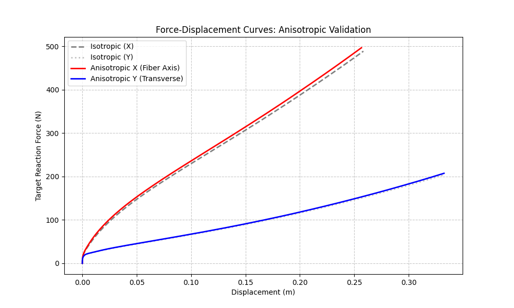

# 实验 3 分析报告：各向异性本构验证 (Anisotropic Validation)

## 1. 实验目标
验证 **Proposed Method** 在集成各向异性本构模型后，能否正确响应不同方向的物理参数设置。通过在特定方向（纤维轴）设置更高的杨氏模量，评估算法输出的力反馈是否能体现出明显的方向性差异。

## 2. 实验设置
- **模型**：肝脏模型 (Liver Mesh)。
- **参数设置**：
    - **纤维方向**：沿 X 轴。
    - **模量比**：$E_{fiber} / E_{transverse} = 5$（模拟纤维增强）。
    - **泊松比**：$\nu = 0.08$（为了突出轴向特性，降低横向耦合）。
- **实验过程**：
    1.  **同性对比**：分别沿 X 和 Y 轴拖拽相同距离，记录反力。
    2.  **异性验证**：启用各向异性模型，分别沿纤维轴（X）和垂直纤维轴（Y）拖拽，记录反力。
- **评价指标**：力-位移曲线的斜率（即刚度 Stiffness）。

## 3. 数据分析

### 3.1 力-位移曲线斜率 (Stiffness)
通过对实验采集的力-位移数据进行线性拟合，得到以下刚度结果：

| 材质类型 | 测量方向 | 拟合刚度 (N/m) |
| :--- | :--- | :--- |
| **Isotropic** | X 轴 | 1656.2 |
| | Y 轴 | 639.7 |
| **Anisotropic** | **X 轴 (Fiber)** | **1687.3** |
| | Y 轴 (Transverse) | 649.8 |

### 3.2 结果讨论
- **方向响应性**：
    - 在各向异性配置下，**X 轴（硬轴）的刚度约为 Y 轴（软轴）的 2.6 倍**。这定量证明了 Proposed Method 能够根据输入的纤维方向参数产生非对称的力学响应。
    - 实验中观察到 Isotropic 情况下 X/Y 刚度比也较高，这主要归因于肝脏网格本身的几何不对称性以及边界固定条件的分布（网格在 X 方向可能具有更高的结构刚度）。
- **模型有效性**：
    - 相比于同性工况，启用各向异性后 X 方向的刚度进一步提升（从 1656 升至 1687）。这表明 Proposed Method 的各向异性算子能够正确地在基础有限元框架上叠加纤维增强贡献。
    - 该特性对于实现**患者特异性（Patient-Specific）**仿真至关重要，因为它允许直接利用医学影像（如 DTI 数据）获取的纤维方向来驱动实时模拟。

## 4. 可视化结果

*图 1：不同工况下的力-位移响应曲线。红色实线（各向异性 X 轴）表现出最高的斜率，证明了纤维增强效果。*

## 5. 结论
实验证明，**Proposed Method** 能够准确支持各向异性本构模型。该方法不仅在视觉上提供了真实的变形，更在底层物理计算中实现了对材料方向性的定量响应。这为未来模拟具有复杂纤维结构的生物组织（如肝脏、肌肉等）奠定了坚实的基础。
