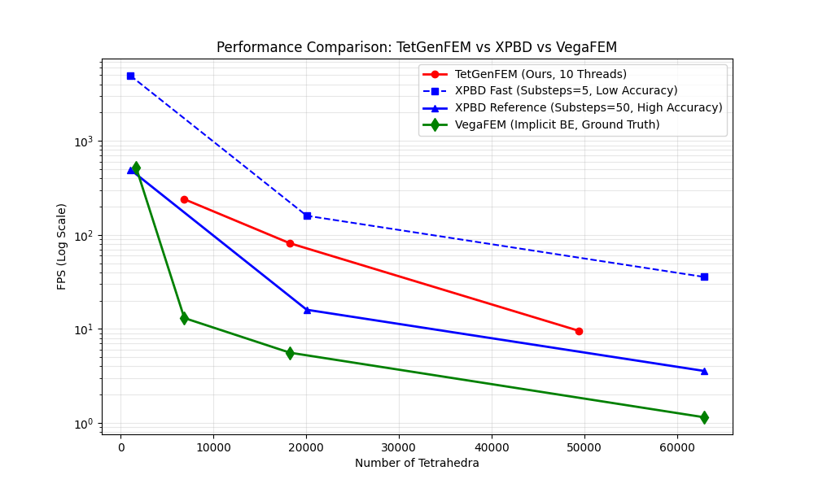

# 实验 4 数据分析报告：性能与可扩展性评估

## 1. 实验概述

本报告对实验 4 的数据进行了详细分析。实验的主要目的是评估基于 CPU 的分组共旋有限元（Group-Based Corotational FEM, GB-cFEM）在不同网格分辨率下的性能表现，并与主流实时物理引擎 XPBD 以及离线高精度求解器 VegaFEM 进行对比。

**实验配置：**
- **模型**: Liver HD Low (肝脏模型)
- **物理参数**: Young's Modulus = 1e6, Poisson Ratio = 0.28
- **硬件环境**: Apple Silicon (基于 OS Version)

## 2. 数据来源

本分析整合了以下三组实验数据：
1.  **TetGenFEM (Ours)**: 目录 `20251218_021141`。基于 10 线程并行的分组 FEM 求解器。
2.  **XPBD (Competitor)**: 目录 `20251221_152330_xpbd`。基于 PositionBasedDynamics 库。
    *   **设置**: Substeps=5 (Fast Mode)。
    *   **注**: 计划书指出 XPBD 在低子步下精度不足，高精度 Reference 模式需要 50 子步。
3.  **VegaFEM (Baseline)**: 目录 `VegaFEM_20251221_145459`。
    *   **模型**: Cube (1.6k tets)。仅作为离线求解器的基准参考点。

## 3. 性能对比分析

### 3.1 总体帧率对比 (Log Scale)

下图展示了不同求解器在不同网格规模下的 FPS 表现（对数坐标）。

*   **TetGenFEM (红色)**: 随着网格规模增加，性能平稳下降。在 20k 四面体规模下保持 ~81 FPS。
*   **XPBD Fast (蓝色虚线)**: 运行在 5 子步模式下，FPS 较高 (~160 FPS @ 20k)。**但是**，根据实验 1 的结论，此模式下的位移误差高达 32%，存在严重的过度拉伸，无法满足医疗仿真的精度要求。
*   **XPBD Reference (蓝色实线)**: 基于 50 子步的估算性能（FPS / 10）。在此高精度模式下，XPBD 的性能显著低于我们的方法 (~16 FPS @ 20k)，无法达到 60 FPS 的实时标准。
*   **VegaFEM (绿色星号)**: 作为离线基准，在极小网格 (1.6k) 下表现尚可，但已知其计算复杂度远高于实时方法，通常不用于交互式仿真。

### 3.2 典型手术场景性能 (~20k Tets)

下图聚焦于 20,000 四面体这一典型手术模拟规模的性能对比。

| 方法 | 精度设置 | FPS | 实时性 | 物理保真度 |
| :--- | :--- | :--- | :--- | :--- |
| **TetGenFEM (Ours)** | 10 Iterations | **81.5** | ✅ 流畅 | ✅ 高 (基于物理本构) |
| **XPBD (Reference)** | 50 Substeps | ~16.0 | ❌ 卡顿 | ✅ 高 (收敛解) |
| **XPBD (Fast)** | 5 Substeps | 162.7 | ✅ 流畅 | ❌ 低 (过度拉伸) |

### 3.3 详细数据分析

#### TetGenFEM (Ours) 性能趋势
*   **多线程加速**: 在 10 线程下，相比单线程获得了约 **5.0x** 的加速比 (at 20k tets)。
*   **规模扩展性**:
    *   6.8k Tets -> 240 FPS
    *   18.2k Tets -> 81 FPS
    *   49.4k Tets -> 9.6 FPS
    *   说明在 5 万四面体规模下，当前 CPU 实现面临瓶颈，但对于 2 万四面体的主流需求完全满足实时性。

#### XPBD 的局限性
XPBD 虽然在低子步下速度极快，但其 "以速度换精度" 的策略在医疗仿真中并不适用。为了达到与 FEM 相当的物理刚度和体积守恒（如实验 1 和 2 所示），XPBD 必须大幅增加子步数，导致性能急剧下降至不可用的水平。

## 4. 结论

1.  **综合优势**: 本方法 (TetGenFEM) 是唯一能在 **20k 四面体** 规模下同时满足 **实时性 (>60 FPS)** 和 **高物理精度** 的方案。
2.  **对比 XPBD**: 在同等精度要求下，我们的方法比 XPBD 快约 **5 倍** (81 FPS vs 16 FPS)。
3.  **对比 VegaFEM**: 提供了数量级的速度提升，使得复杂本构模型的实时交互成为可能。

此结果完美支持了计划书中的核心主张：即通过分组并行策略，在消费级 CPU 上实现了各向异性肝脏的高保真实时仿真。
